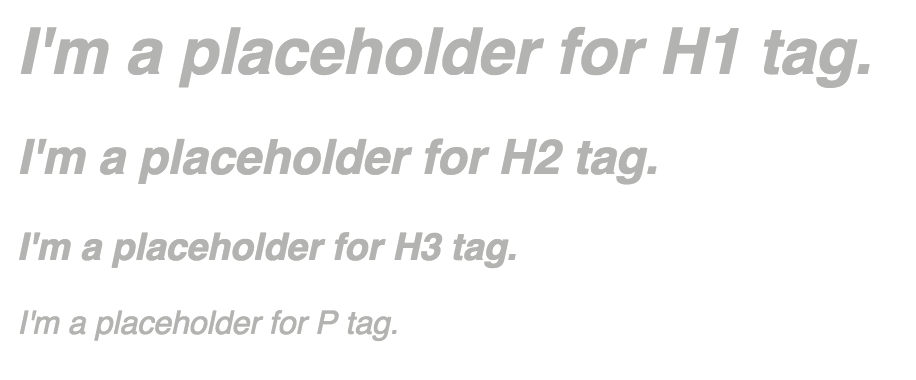

# MediumEditorMultiPlaceholders Plugin
 A plugin that allows you to setup multiple placeholders with [MediumEditor](https://github.com/yabwe/medium-editor)

 [](https://nodei.co/npm/medium-editor-multi-placeholders-plugin/)

 [](https://travis-ci.org/smiled0g/medium-editor-multi-placeholders-plugin)
 [](https://david-dm.org/smiled0g/medium-editor-multi-placeholders-plugin)
[](https://david-dm.org/smiled0g/medium-editor-multi-placeholders-plugin#info=devDependencies)

# Demo


Try at [Demo page](http://smiled0g.github.io/medium-editor-multi-placeholders-plugin/)

# Basic usage

### Installation
**Via npm:**

Run in your console:
```bash
npm install medium-editor-multi-placeholders-plugin
```
Then build the project by running
```bash
grunt
```

**Via bower:**

```bash
bower install medium-editor-multi-placeholders-plugin
```

### Usage

First thing: don't forget to load the plugin **after** MediumEditor

```html
<script src="dist/medium-editor-multi-placeholders-plugin.min.js"></script>
```

Now when you create MediumEditor instance, just disable normal placeholder and specify the extension and placeholder options:
```js
var editor = new MediumEditor('#editor', {
      placeholder: false,
      extensions: {
        'multi_placeholder': new MediumEditorMultiPlaceholders({
          placeholders: [
              {
                tag: 'h1',
                text: 'Title'
              },
              {
                tag: 'p',
                text: 'Tell your story...'
              }
          ]
        })
      }
    });
```

## Plugin Options

The plugin itself only takes one option: ```placeholders``` which is an array of placeholder objects. Each placeholder object is in the format ```{ tag: 'HTMLTag', text: 'Placeholder Text' }```.

```js
var multiPlaceholders = new MediumEditorMultiPlaceholders({
    placeholders: [
	    /* Your place holders goes here
	       You can have as many placeholders as you want!
	       Example: { tag: 'h1', text: 'Title' } */
    ]
});
```

## Known Issues

Conflicts with [MediumEditor Insert Plugin](https://github.com/orthes/medium-editor-insert-plugin), because `placeholder: false` doesn't work with the some version of the it.

## License

MIT: https://github.com/smiled0g/medium-editor-multi-placeholders-plugin/blob/master/LICENSE
